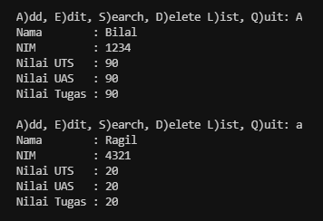
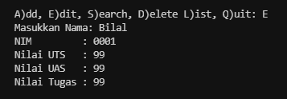
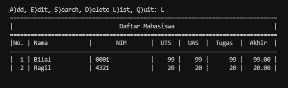
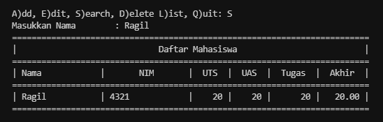
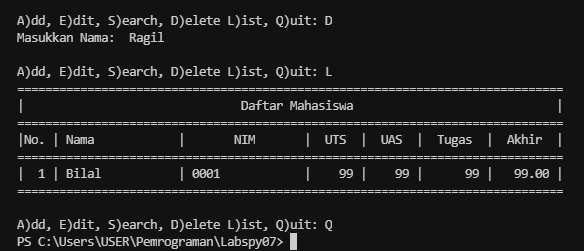

# Pertemuan 12

Konsep Program:

> Buatlah program sederhana dengan mengaplikasikan penggunaan class. Buatlah class untuk menampilkan daftar nilai mahasiswa, dengan ketentuan:
> - Method *tambah()* untuk menambahkan data
> - Method *tampilkan()* untuk menampilkan data
> - Method *hapus(nama)* untuk menghapus data berdasarkan nama
> - Method *ubah(nama)* untuk mengubah data berdasarkan nama
> - Buatlah diagram class, flowchart dan penjelasan program pada README.md

## Penjelasan:

- Pada direktori modul terdapat program `function.py` yang berisi fungsi - fungsi pada program yang sudah dibuat, dan pada direktori view terdapat program `lihat_data.py` yang berisi kode program untuk menapilkan Data Mahasiswa dan Hasil Pencarian. Dan terakhir program `main.py` yang terdapat diluar direktori yang berfungsi untuk menjalankan program. Ketiga direktori tersebut akan berhubungan menggunakan `from ... import *` kode program itu berfungsi agar kita dapat memanggil file lain di dalam satu module yang berbeda.

### Function.py

- Membuat Class dengan nama `data_mahasiswa` yg berisi variabel kosong dengan tipe data string (str)
```python
class data_mahasiswa:
    nama = ""
    nim = ""
    tugas = ""
    uts = ""
    uas = ""
```

- Membuat variabel dict dengan nama `mahasiswa` dengan nilai kosong
- lalu terdapat function `def tambah_data` yang berfungsi untuk Menambah Data Mahasiswa
```python
mahasiswa = {}
def tambah_data():
    global mahasiswa
    mhsw = data_mahasiswa()
    nama = input("Nama        : ")
    mhsw.nim = input("NIM         : ")
    mhsw.uts = int(input("Nilai UTS   : "))
    mhsw.uas = int(input("Nilai UAS   : "))
    mhsw.tugas = int(input("Nilai Tugas : "))
    mhsw.akhir = mhsw.tugas * 30/100 + mhsw.uts * 35/100 + mhsw.uas * 35/100
    mahasiswa[nama] = mhsw.nim, mhsw.tugas, mhsw.uts, mhsw.uas, mhsw.akhir
    return mahasiswa
```

- Lalu ada function `def ubah_data` yang befungsi untuk Mengubah Data Mahasiswa berdasarkan nama, namun jika nama tidak ada didalam data, maka program akan menampilkan "Nama tidak ditemukan"
```python
def ubah_data():
    nama = input("Masukkan Nama: ")
    if nama in mahasiswa.keys():
        nim = input("NIM         : ")
        uts = int(input("Nilai UTS : "))
        uas = int(input("Nilai UAS : "))
        tugas = int(input("Nilai Tugas : "))
        akhir = tugas * 30/100 + uts * 35/100 + uas * 35/100
        mahasiswa[nama] = nim, tugas, uts, uas, akhir
    else:
        print("Nama {0} tidak ditemukan".format(nama))
```

- Berfungsi untuk menghapus data yang ada didalam list
```python
def hapus_data():
    nama = input("Masukkan Nama:  ")
    if nama in mahasiswa.keys():
        del mahasiswa[nama]
    else:
        print("Nama {0} Tidak Ditemukan".format(nama))
```

- Berfungsi untuk mencari data sekaligus menampilkan data yg dicari berdasarkan nama
```python
def cari_data():
    nama = input("Masukkan Nama        : ")
    if nama in mahasiswa.keys():
        print("=" * 73)
        print("|                             Daftar Mahasiswa                          |")
        print("=" * 73)
        print("| Nama            |       NIM       |  UTS  |  UAS  |  Tugas  |  Akhir  |")
        print("=" * 73)
        print("| {0:15s} | {1:15s} | {2:5d} | {3:5d} | {4:7d} | {5:7.2f} |"
            .format(nama, mahasiswa[nama][0], mahasiswa[nama][1], mahasiswa[nama][2], mahasiswa[nama][3], mahasiswa[nama][4]))
        print("=" * 73)
```

### lihat_data.py

- Berfungsi untuk mengimport module function agar dapat mengakses program file `function.py` kedalam program `lihat_data.py`
```python
from modul.function import *
```

- Untuk menampilkan Daftar Data Mahasiswa
```python
def cetak_daftar_nilai():
    if mahasiswa.items():
        print("=" * 78)
        print("|                               Daftar Mahasiswa                             |")
        print("=" * 78)
        print("|No. | Nama            |       NIM       |  UTS  |  UAS  |  Tugas  |  Akhir  |")
        print("=" * 78)
        i = 0
        for z in mahasiswa.items():
            i += 1
            print("| {no:2d} | {0:15s} | {1:15s} | {2:5d} | {3:5d} | {4:7d} | {5:7.2f} |"
                  .format(z[0][:13], z[1][0], z[1][1], z[1][2], z[1][3], z[1][4], no=i))
        print("=" * 78)
    else:
        print("=" * 78)
        print("|                               Daftar Mahasiswa                             |")
        print("=" * 78)
        print("|No. | Nama            |       NIM       |  UTS  |  UAS  |  Tugas  |  Akhir  |")
        print("=" * 78)
        print("|                                TIDAK ADA DATA                              |")
        print("=" * 78)
```

- Untuk menampilkan Hasil Pencarian
```python
def cetak_hasil_pencarian():
    nama = input("Masukkan Nama        : ")
    if nama in mahasiswa.keys():
        print("=" * 73)
        print("|                             Daftar Mahasiswa                          |")
        print("=" * 73)
        print("| Nama            |       NIM       |  UTS  |  UAS  |  Tugas  |  Akhir  |")
        print("=" * 73)
        print("| {0:15s} | {1:15s} | {2:5d} | {3:5d} | {4:7d} | {5:7.2f} |"
              .format(nama, mahasiswa[nama][0], mahasiswa[nama][1], mahasiswa[nama][2], mahasiswa[nama][3], mahasiswa[nama][4]))
        print("=" * 73)
```

### Main.py

- Berfungsi untuk mengimport module `lihat__data.py` yang ada didalam direktori view
```python
from view.lihat_data import *
```

- Untuk melakukan perulangan pada program dan Menu untuk menambah, ubah, hapus, cetak hasil pencarian dan cetak data mahasiswa.
```python
while True:
    c = input("\nA)dd, E)dit, S)earch, D)elete L)ist, Q)uit: ")

    if c.lower() == 'a' or c.lower() == 'A':
        tambah_data()

    elif c.lower() == 'e' or c.lower() == 'E':
        ubah_data()

    elif c.lower() == 's' or c.lower() == 'S':
        cetak_hasil_pencarian()

    elif c.lower() == 'd' or c.lower() == 'D':
        hapus_data()

    elif c.lower() == 'l' or c.lower() == 'L':
        cetak_daftar_nilai()

    elif c.lower() == 'q' or c.lower() == 'Q':
        break

    else:
        print("Silahkan pilih menu yang tersedia")
```

## OUTPUT

- Tambah Data



- Ubah Data



- Lihat Data



- Cari Data



- Hapus Data dan Keluar Program


